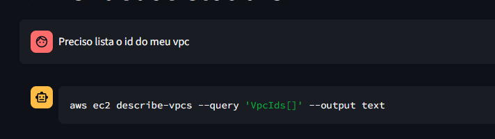
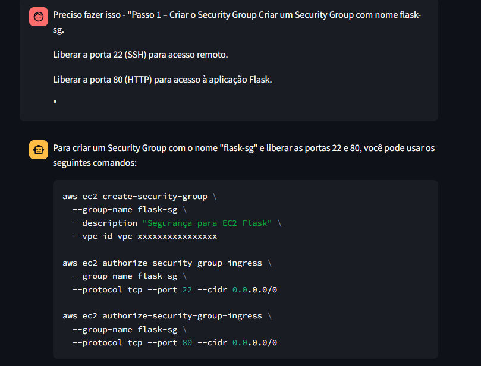
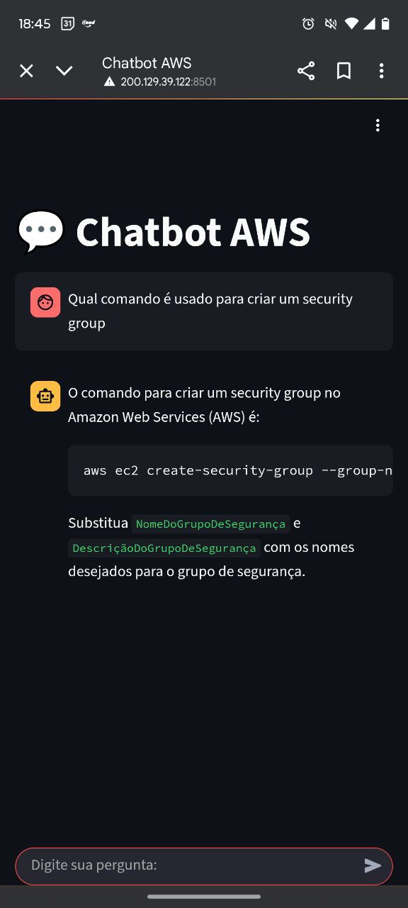
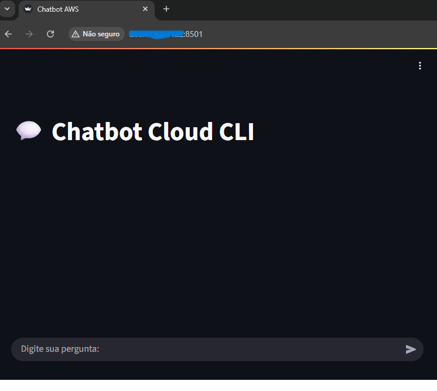
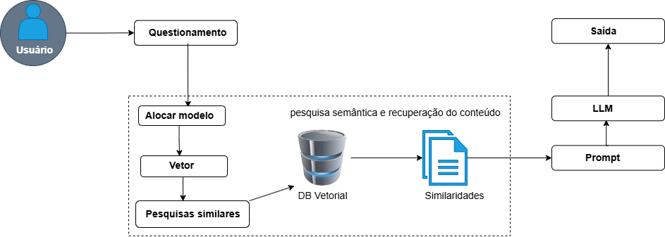
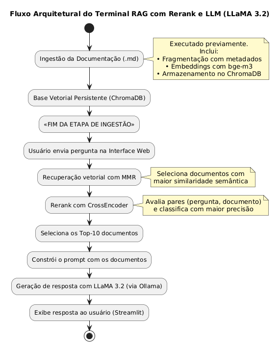

# Chatbot Cloud CLI

Este projeto implementa um chatbot interativo para auxiliar no uso de comandos da AWS CLI e GCP CLI. Ele utiliza modelos de machine learning para processar consultas, recuperar informações relevantes e gerar respostas precisas.

---

## 📋 **Funcionalidades**

- **Interface Web Interativa**: Desenvolvida com Streamlit, permite que os usuários interajam com o chatbot de forma simples e intuitiva.
- **Processamento de Consultas**: Utiliza um banco de dados vetorial (ChromaDB) para recuperar documentos relevantes.
- **Reranking de Documentos**: Reordena os documentos com base na relevância usando um modelo de reranking (`CrossEncoder`).
- **Geração de Respostas**: Responde às perguntas com base em documentos relevantes e um modelo de linguagem (LLM).
- **Ingestão de Arquivos Markdown**: Processa arquivos `.md` para alimentar o banco de dados vetorial.

---

## 🗂️ **Estrutura do Projeto**

```plaintext
Projeto_Terminal_MultCloud/
├── chat_bot/
│   ├── chat_reranker.py       # Lógica de recuperação e reranking de documentos
│   ├── interface.py           # Interface web interativa com Streamlit
│   ├── md_ingestion.py        # Ingestão de arquivos Markdown no banco de dados
│   ├── Models.py              # Inicialização dos modelos de embeddings e linguagem
│   ├── requirements.txt       # Dependências do projeto
├── data/                      # Diretório para arquivos Markdown
├── db/                        # Banco de dados vetorial (ChromaDB)
├── imagens/                   # Diretório com imagens do projeto
│   ├── caso_vpcs.png          # Exemplo de resposta sobre VPCs
│   ├── caso_security.png      # Exemplo de resposta sobre Security Groups
│   ├── caso_mobile.jpg        # Tela inicial no mobile
│   ├── tela_inicial.png       # Tela inicial no desktop
│   ├── rag.png                # Explicação sobre o funcionamento do RAG
│   ├── fluxoArquitetural.png  # Fluxo arquitetural da aplicação
└── README.md                  # Documentação do projeto
```

---

## 🚀 **Como Executar**

### **1. Pré-requisitos**

Certifique-se de ter instalado:

- Python 3.8 ou superior
- `pip` para gerenciar pacotes Python

### **2. Crie um Ambiente Virtual**

É altamente recomendado criar um ambiente virtual para isolar as dependências do projeto. Siga os passos abaixo:

#### **Windows**

```bash
python -m venv venv
venv\Scripts\activate
```

#### **Linux/Mac**

```bash
python3 -m venv venv
source venv/bin/activate
```

### **3. Instale as Dependências**

Com o ambiente virtual ativado, instale as dependências do projeto:

```bash
pip install -r requirements.txt
```

### **4. Execute a Interface Web**

Inicie o chatbot com o comando:

```bash
streamlit run chat_bot/interface.py
```

Acesse a interface no navegador em: [http://localhost:8501](http://localhost:8501)

---

## 🛠️ **Componentes Principais**

### **1. `chat_reranker.py`**

- Recupera documentos relevantes do banco de dados vetorial (ChromaDB).
- Reordena os documentos com base na relevância usando um modelo de reranking (`CrossEncoder`).
- Gera respostas utilizando um modelo de linguagem (LLM).

### **2. `interface.py`**

- Interface web desenvolvida com Streamlit.
- Permite que os usuários enviem perguntas e visualizem respostas.
- Mantém o histórico de mensagens na sessão do usuário para exibição contínua.

### **3. `md_ingestion.py`**

- Processa arquivos Markdown (`.md`) e os divide em chunks menores.
- Armazena os chunks no banco de dados vetorial (ChromaDB) para recuperação futura.

### **4. `Models.py`**

- Inicializa os modelos de embeddings e linguagem:
  - **Embeddings**: Vetorização de texto com `OllamaEmbeddings`.
  - **LLM**: Geração de respostas com `ChatOllama`.

---

## 📂 **Diretórios Importantes**

- **`data/`**: Diretório onde os arquivos Markdown devem ser colocados para ingestão.
- **`db/`**: Diretório onde o banco de dados vetorial (ChromaDB) é armazenado.
- **`imagens/`**: Diretório contendo imagens ilustrativas do projeto.

---

## 📷 **Imagens do Projeto**

### **Exemplos de Uso**

#### **1. Resposta sobre VPCs**



#### **2. Resposta sobre Security Groups**



### **Interface**

#### **1. Tela inicial no mobile**



#### **2. Tela inicial no desktop**



---

## 🧠 **Funcionamento do RAG**

O modelo de Recuperação e Geração (RAG) funciona da seguinte forma:


---

## 🔄 **Fluxo Arquitetural**

O fluxo arquitetural da aplicação é descrito na imagem abaixo:


---

## ⚙️ **Configurações**

As configurações do projeto podem ser ajustadas por meio de variáveis de ambiente. Exemplos:

- `CHROMA_DB`: Caminho para o banco de dados vetorial.
- `RERANKER_MODEL`: Nome do modelo de reranking.
- `RETRIEVE_K`: Número de documentos a recuperar.
- `MMR_LAMBDA`: Parâmetro para busca com Maximal Marginal Relevance (MMR).

---

## 🧪 **Testando o Chatbot**

1. Inicie o chatbot com o comando `streamlit run chat_bot/interface.py`.
2. Digite perguntas relacionadas à AWS CLI ou GCP CLI na interface.
3. O chatbot responderá com comandos relevantes ou mensagens de erro, caso não encontre informações.

---

## 📖 **Exemplo de Uso**

### **Entrada do Usuário**

```plaintext
Como faço para criar um bucket no S3?
```

### **Resposta do Chatbot**

```plaintext
aws s3api create-bucket --bucket NOME_DO_BUCKET --region REGIÃO
```

---

## 🤝 **Contribuições**

Contribuições são bem-vindas! Sinta-se à vontade para abrir issues ou enviar pull requests.

---

## 📝 **Licença**

Este projeto está licenciado sob a [MIT License](LICENSE).

---

## 📧 **Contato**

Se tiver dúvidas ou sugestões, entre em contato:

- **Email**: anchietanalbano@gmail.com
- **LinkedIn**: [Anchieta Albano](https://www.linkedin.com/in/anchieta-albano/)
